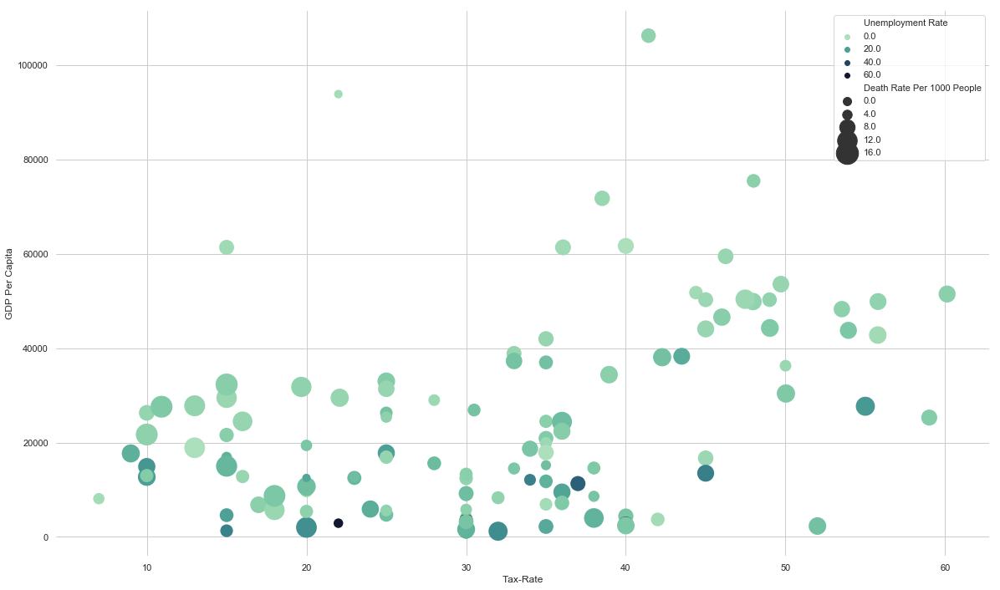

# Donaldo Celaj
## Data Scientist
email: donaldocelaj@ gmail.com

I'm very curious about economics and how tax rates effect society as a whole. I did a study involving 118 countries and seeing how their tax rates affected aspects of their society.

https://medium.com/@donaldocelaj/effect-of-income-taxes-on-the-individual-8f744b1a7611 

code for data: https://github.com/donaldocelaj/DS-Unit-1-Sprint-5-Data-Storytelling-Blog-Post/blob/master/Tax%20Article%20Code.ipynb

